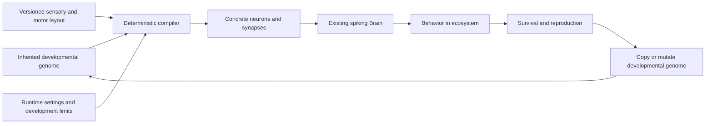

# Developmental connectome genome: proposal and implementation roadmap

Status: design draft, 2026-09-08. This document proposes an experimental encoding; it does not change simulation behavior.

The proposal is to inherit a compact program for building a brain: spatial fields describe neuron properties, projection rules describe connectivity, and reusable modules describe repeated circuits. A deterministic developmental compiler turns this genome into the existing spiking `Brain` at birth. Evolution modifies the program through the ecosystem's ordinary reproduction process.

The main hypothesis is that shared rules make coordinated, useful variations more accessible: one mutation could strengthen both left and right obstacle avoidance, add a repeated sensory relay, or change a module's integration threshold. Compactness is useful, but the important outcome is a better distribution of behavioral changes under mutation.

## Assessment and related work

This is a promising direction for the simulator. Geometry, repetition, bilateral symmetry, local connectivity, and modularity are plausible biases for embodied behavior. They should be treated as hypotheses to test, rather than guarantees of greater stability or intelligence. Shared genes can also cause widespread damage: changing one global threshold field might silence the whole controller.

The nearest established family is indirect or developmental encoding. HyperNEAT generates connectivity from neuron coordinates; ES-HyperNEAT extends this to deriving neuron placement and density. The overlap supports the basic architecture, but does not establish that it will improve this ecosystem or its recurrent spiking controllers. We can borrow the representation ideas without adopting NEAT's population management or replacing natural reproduction. [Risi and Stanley, 2012](https://direct.mit.edu/artl/article/18/4/331/2720/An-Enhanced-Hypercube-Based-Encoding-for-Evolving)

Experiments with HyperNEAT found benefits as task regularity increased, but also difficulty with useful irregularities; hybrid indirect/direct encodings helped in those settings. This supports leaving room for localized exceptions and asymmetry. It is not evidence that we should immediately implement a large hybrid system. [Clune et al., 2011](https://jeffclune.com/publications/2011-CluneEtAl-IndirectEncodingAcrossRegularityContinuum-IEEE-TEC.pdf)

There is also a relevant biological distinction: developmental mechanisms can differ in which variants are accessible even when they produce the same initial phenotype. A study of small gene circuits interpreting morphogen gradients illustrates this. For our implementation, the analogous question is how offspring vary around a working parent, not just what a generator can represent. This analogy does not make the proposed generator a faithful model of biological development. [Dynamics of gene circuits shapes evolvability](https://pmc.ncbi.nlm.nih.gov/articles/PMC4343095/)

Three refinements are essential:

1. A neuron property is a function of one location; a connection is a relation between two locations and their cell identities. Two-dimensional heat maps alone do not specify a directed graph.
2. Symmetric positions and probabilities do not guarantee symmetric sampled wiring. Corresponding neurons and edges must share developmental decisions.
3. Smaller genomes do not necessarily produce easier evolution. Measure locality, robustness, and useful variation, alongside genome size and ecological success. With only five hidden neurons in today's ancestor, a rich generator could initially require more parameters than the direct circuit.

## What the simulator already provides

| Existing component | Consequence for the proposal |
| --- | --- |
| `Brain::Neuron` has `Vec2 position`, threshold, bias, and background sensitivity | Spatial development can supply existing parameters without changing the integrator. |
| `Brain::Synapse` has directed endpoints, signed weight, and delay | The compiler can emit the current runtime format. |
| `Brain::from_components` reconstructs delays from distance and clamps hidden bias | This is the compiler boundary; supplied custom delays are currently overwritten. |
| Default interface has 83 sensory inputs and six outputs | Keep indices and meanings stable; add spatial and reflection metadata alongside them. |
| Sparse ancestor has five hidden neurons and some repeated sensory circuits | It supplies a useful functional reference, but is not exactly symmetric. |
| Birth copies `parent.brain`, mutates components, then may prune a hidden neuron | Generated inheritance needs a separate path that mutates the developmental genome. |
| `Brain` serialization includes delayed currents, potentials, and motor traces | Full continuation must still restore runtime state, not regenerate a newborn brain. |
| Viewer currently arranges neurons in input/hidden/output columns | Add an actual substrate view to make the new representation inspectable. |

Relevant code: [brain.hpp](../include/neuroevo/brain.hpp), [brain.cpp](../src/brain.cpp), [ecosystem.hpp](../include/neuroevo/ecosystem.hpp), [ecosystem.cpp](../src/ecosystem.cpp), [ancestor](../src/ecosystem_ancestor.cpp), [sensing](../src/ecosystem_sensing.cpp), [serialization](../src/ecosystem_io.cpp), [brain state](../src/brain_state.cpp), and [viewer](../tools/view_ecosystem.py).

## Representation



Keep three concepts separate: inherited genes, the developed graph, and lifetime neural state. The compiler runs at creation of a new phenotype, rather than at every neural step. Exact copies can reuse the immutable graph, while maintaining independent lifetime state.

The minimum well-defined genome needs a versioned decoder contract, a hidden-cell placement/count rule, parameter defaults, and an edge/weight rule. There is no fundamental minimum number of nonconstant heat maps: constant defaults are valid fields. A zero-edge graph can be well-defined and behaviorally useless. Structural validity and viability are different checks.

### Substrate and interface

Start with a fixed disk centered at `(0.5, 0.5)`, radius `0.45`, in the current unit coordinate range. Reflection is `R(x, y) = (1 - x, y)`. This preserves the approximate coordinate scale already used by conduction delays. Disk shape is a convenient prior, not a claim about optimal neural anatomy.

Use the horizontal axis for left/right and the vertical axis for sensory-to-motor organization. Place corresponding left/right sensors at reflected coordinates, directional center sensors on the midline, and non-directional bodily signals at distinct midline anchors. Separate modalities into bands or regions. Turn outputs form a reflected pair; forward, forage, call, and attack are separate midline outputs. Hidden cells initially occupy a small fixed collection of mirrored pairs and midline sites.

Add explicit `PortDescriptor` metadata: stable semantic ID, existing numeric slot, modality, position, and reflected partner. Reflect every directional family, including visual sectors, hearing, contact, and proprioceptive left/right turn signals. In current code, sector zero is rightmost and `eco_sectors - 1` is leftmost; derive the mapping from constants, not the stale comment mentioning sector four. Check all supported sensing/predation configurations.

Sensory slots and motor slots remain fixed by the body interface. Density fields initially govern hidden neurons only. Geometry does not replace semantic identity: energy and food proximity remain different inputs even if their anchors are nearby. Repetition across sectors should share rules for the same modality without forcing unrelated modalities to behave identically.

### Fields as compact functions

Encode fields as a baseline plus a small list of smooth patches, initially Gaussian bumps and simple gradients. Render heat maps from those functions. A stored pixel grid would spend genes on individual samples and make spatial coherence harder to maintain.

For a scalar channel, an initial form is:

```text
f(p) = baseline + sum_k amplitude[k] * basis(p, center[k], width[k])
symmetric_basis(p) = (basis(p, c, w) + basis(R(p), c, w)) / 2
```

Widths stay positive through bounded log parameters. Use bounded transforms for probabilities and physical parameters. Patches have persistent IDs; moving or editing a patch preserves its identity. Begin with broad structure and a few localized corrections rather than dozens of independently configurable channels.

| Channel or rule | First version | Later extension |
| --- | --- | --- |
| Hidden density | Fixed sites and count | Persistent candidate sites activated by a density field |
| Threshold | Bounded scalar field | Per-module sensory sensitivity and integration properties |
| Bias/background response | Fixed defaults or narrowly bounded fields | Localized evolvable channels under existing bias safeguards |
| Outgoing connectivity | Sparse projection propensity | Target expected degree and dispersion |
| Incoming connectivity | Target attractiveness | Joint degree calibration and input budgets |
| Connection range | Distance-decay scale | Mixture of local and long-range projections |
| Direction | Source/target role and relative displacement | Vector fields and crossing preferences |
| Weight | Projection-specific signed mean and bounded variation | Cell-type-specific distributions |
| Cell type | Existing LIF dynamics and signed synapses | Excitatory/inhibitory labels and other explicitly implemented types |
| Motifs/modules | Absent, or one explicit reusable relay template | Parameterized recurrent and repeated modules |

Cell type must have a concrete interpretation. The current runtime has no per-neuron transmitter type and permits mixed outgoing signs. A future excitatory/inhibitory label could constrain outgoing weights without changing the integrator, but enforcing that would change the space of possible circuits and cannot exactly preserve all existing neurons. New membrane equations or plasticity mechanisms require runtime work and should be separate experiments.

### Directed connectivity

A projection rule reads source and destination position, role, modality, module identity, distance, and relative direction. One possible initial rule is:

```text
score(i, j) = base_projection_logit(role_i, role_j, modality_i)
            + out_field(position_i) + in_field(position_j)
            - distance(i, j) / positive_range
            + direction_term(i, j) + module_affinity(i, j)
P(i -> j) = sigmoid(score(i, j))
```

Restrict candidates to the existing intended topology: no incoming edges to sensory neurons, no outgoing edges from motors, no self-edges, and at most one edge per ordered pair. Hidden recurrence and direct sensory-to-motor connections are allowed. Validate these explicitly; `from_components` alone does not enforce every rule.

The first implementation should name `out_field` and `in_field` as propensities, not promise exact degrees. Expected out-degree is `sum_j P(i -> j)` and expected in-degree is `sum_i P(i -> j)`. Exact incoming and outgoing budgets cannot be selected independently: their totals must agree and the permitted graph must realize them. Joint calibration can come later. Independent edges also do not give arbitrary degree distributions; broad or structured degree distributions require suitable heterogeneous propensities or a different sampler.

Pair probabilities do not specify higher-order motifs either. Independent edge draws can match degree statistics while almost never creating a useful oscillator. Later motif genes should instantiate correlated sets of edges or reusable module templates, with defined boundary ports and parameter sharing. A motif density field specifies where templates tend to appear; it is not itself the motif specification.

### Deterministic development and symmetry

Use a persisted developmental seed and stable semantic IDs to generate random values by key. For example:

```text
u_edge = uniform_hash(seed, projection_id, canonical_reflection_pair(i, j), "exist")
edge exists when u_edge < P(i -> j)
```

The canonical key identifies `(i, j)` with `(R(i), R(j))`, while preserving edge direction; it must not generally identify `(i, j)` with `(j, i)`. Give mirrored weights and cell parameters shared keys too. Midline cases have one representative and must not create duplicates. Sort generated cells and edges by stable IDs before assigning runtime indices and accumulating currents.

Do not reseed from the child's creature ID, genome ID, a hash of all gene values, or mutation count. Do not consume a sequential random stream whose later decisions shift when an earlier cell is inserted. Those approaches turn a small edit into an unrelated new graph. Keep the developmental seed fixed under ordinary mutation; reserve local randomness changes for explicit future operators.

Hard size limits must select complete reflected groups using stable priorities. Arbitrarily truncating an edge array could break symmetry. Even with persistent randomness, probabilities crossing sampling thresholds cause discrete changes, and capacity competition can affect other connections. Measure those effects rather than calling the decoder perfectly smooth.

Scalar fields should satisfy `f(Rp) = f(p)` in strict mode. Connection rules must satisfy `P(Ri, Rj) = P(i, j)`. Direction vectors reflect their horizontal component; otherwise a uniform leftward preference silently breaks symmetry. Later, small localized asymmetric residuals can relax these constraints.

Structural symmetry provides reflection-consistent responses under reflected input, state, and stochastic drives; it does not guarantee stable dynamics or useful behavior. Perfectly symmetric inputs and state can yield identical turn outputs and cancel steering. Today's ancestor deliberately biases left for a frontal obstacle/contact. Preserve a controlled tie-breaking mechanism or allow slight inherited asymmetry, and test front-on collisions explicitly. Independent lifetime background noise already breaks individual trajectories' exact symmetry; deterministic symmetry tests should disable it or provide paired drives.

### Placement, growth, and specialization

Keep positions and hidden count fixed in the first compiler. Later use a bounded, deterministic set of candidate sites with persistent IDs: activate a mirrored site pair when a shared fixed random value falls below the density field there. This gives density mutations local effects without redrawing every neuron. Midline candidates are separate singletons. A newly active neuron may legitimately alter some incident connectivity; unrelated IDs and random decisions remain unchanged.

Avoid global resampling, position sorting that changes identity, and competitive minimum-distance placement until their disruption is understood. Candidate sites are an initial discretization, not the final expressiveness limit. Later module duplication can produce fresh persistent IDs and an affine placement transform, allowing repetition to scale beyond the original candidate bank.

New layers can be added evolutionarily when they have semantics in the decoder. For example, a new latent spatial signal could start with zero coupling into existing threshold/projection rules and subsequently acquire useful influence. New patches in an existing channel are an even simpler first growth operator. A channel named "new neuron behavior" cannot acquire a new physical meaning by appearing in a genome; its consumers must already exist, or the simulator must be extended.

A later field expression graph or CPPN could compose latent channels into more elaborate patterns. If this is introduced, enforce acyclic evaluation or explicitly define iterative dynamics. Start with the simpler basis representation because its mutation effects and heat maps are easier to inspect.

## Mutation and runtime boundaries

Use separate developmental mutation settings, while retaining the ecosystem's copy/slight/strong birth categories and body inheritance policy. Do not reuse a direct synapse-edit sigma as if it had the same behavioral scale as a field coefficient.

Slight mutations should edit one patch amplitude, center, width, projection parameter, or module-local parameter with bounded scope. Strong mutations can add/remove a patch or projection, duplicate a module, activate growth, or introduce a small asymmetric residual. Begin new structure with low influence, balance addition/removal opportunities, and record how many cells and edges each operator actually changes. Shared changes are deliberate, but the typical effect of a slight edit should not grow unchecked with brain size.

For a developmental birth: inherit/copy genes, mutate if selected, compile the graph, and reset lifetime state. Do not call `Brain::mutate` afterward. Initially disable disconnected-neuron pruning for this encoding. If cleanup is later desired, make it a deterministic decoder stage with clear gene-to-phenotype semantics and symmetry-preserving decisions. Independently pruning one runtime neuron would otherwise leave genes unable to reconstruct the inherited brain.

The generator must return a bounded structurally valid graph, including when it is disconnected or silent. Do not silently repair every unused motor, resample until an offspring behaves well, or insert selection trials into reproduction. The current ancestor's disconnected attack output is valid. Invalid configuration or corrupted genome data is an error; poor ecological performance is an evolutionary outcome.

Keep the current neural costs based on developed neuron, synapse, and spike counts: a compact genome must not make a huge brain energetically free. Add development-time and serialized-size telemetry before considering extra modeled costs.

## Suggested C++ architecture

Illustrative types, not a committed API:

```cpp
struct DevelopmentalGenome {
    std::uint32_t schema_version;
    std::uint32_t decoder_version;
    std::uint64_t development_seed;
    std::vector<FieldGene> fields;
    std::vector<ProjectionGene> projections;
    std::vector<ModuleGene> modules; // empty in the first compiler
};

using BrainGenome = std::variant<DirectBrainGenome, DevelopmentalGenome>;

DevelopedConnectome develop(const DevelopmentalGenome&,
                           const SensorimotorLayout&,
                           const DevelopmentConfig&);
Brain instantiate(const DevelopedConnectome&, BrainConfig);
```

`DevelopedConnectome` contains stable cell/edge IDs, positions, parameter values, and provenance showing which fields/rules affected each component. `instantiate` translates IDs into `[inputs, hidden, outputs]` indices, sets the actual hidden count, and calls `Brain::from_components`. The `Brain` remains the executor. A practical first patch can represent direct genomes by existing component vectors rather than requiring a complete runtime refactor.

Separate evolvable genes from experiment settings. Disk geometry/interface version, decoder limits, and mutation policy belong to saved configuration initially; inherited field coefficients and projection parameters belong to the genome. Cache keys must include every input that affects development or instantiation, including decoder/layout versions and relevant configuration, not just a lineage ID.

| Location | Proposed change |
| --- | --- |
| New `include/neuroevo/brain_genome.hpp` | Encoding tag, developmental genes, stable identities |
| New `include/neuroevo/brain_development.hpp` and `src/brain_development.cpp` | Field evaluation, deterministic graph compilation, validation/provenance |
| `src/ecosystem_sensing.cpp` and `include/neuroevo/ecosystem.hpp` | Versioned port metadata and reflection mapping |
| `include/neuroevo/config.hpp`, `src/config.cpp`, `src/checkpoint_fields.hpp` | Development limits, encoding choice, and separate mutation controls |
| `src/ecosystem.cpp` and `src/ecosystem_ancestor.cpp` | Founder construction and inheritance dispatch |
| `src/ecosystem_io.cpp` | Save developmental genes alongside the developed brain and state |
| `src/ecosystem_main.cpp` | Preserve genes on founder import; validate interface compatibility |
| `tools/view_ecosystem.py` | Substrate/heat-map display, mirrored partners, mutation overlays |
| `CMakeLists.txt` and focused tests | Register implementation and mechanical invariants |

Current ecosystem checkpoints are format 22 and the brain-state format is 3. Extend the outer checkpoint format when adding genome records; the inner brain format can remain unchanged if its state representation does. Either implement an explicit format-22 reader mapping old circuits to direct genomes or report a version incompatibility. Never infer a developmental genome from an old circuit during ordinary load.

Save both the developmental genome and the realized graph/runtime state. On resume, restore neural buffers and RNG streams exactly; do not call development in place of restoration. Future births require the saved decoder semantics. Unknown decoder versions must fail explicitly or go through a deliberate migration. Define deterministic guarantees for the supported build/platform first; cross-platform bitwise results require specified hashing, numeric transforms, and floating-point behavior.

Founder import currently expands interfaces by inserting sensory/motor components. Developmental imports should initially require a matching layout version and compatible interpretation settings. A later explicit migration can map semantic IDs and specify new-port behavior. Exporting only the developed graph intentionally converts to direct encoding and must be labeled as such.

## Roadmap and acceptance criteria

| Stage | Deliverable | Evidence required before expanding scope |
| --- | --- | --- |
| 0. Establish comparisons | Capture direct-ancestor behavior, a versioned reflection map, mutation-effect diagnostics, and a design for a tied left/right direct control | Every sensory/motor slot maps correctly; reflected mapping is an involution; baseline results and configurations are saved |
| 1. Fixed substrate compiler | Disk layout, fixed small hidden population, a few symmetric fields, directed projection rules, persistent sampling, and graph inspection | Repeated compilation agrees; strict symmetry holds; bounds and graph constraints hold; localized edits do not reshuffle unrelated random decisions |
| 2. Inheritance integration | Explicit genome storage, copy/slight/strong developmental mutation, founder option, checkpoint/import support, and minimal viewer provenance | Parent stays unchanged; copies regenerate the same graph; child state resets; resumed trajectories match uninterrupted runs |
| 3. Ecological comparison | Direct, symmetry-tied direct, and developmental populations in separate matched experiments | Report mutation robustness, sustained descendant reproduction, frontier occupancy, and cost across repeated seeds, including extinctions |
| 4. Growth and modules | Density-driven hidden growth, local/global projections, paired module duplication, bounded asymmetric exceptions | Growth preserves identities; degree/cost remain controlled; repeated modules yield measurable benefits over the simpler encoding |
| 5. Extensible development | Evolvable latent channels, composed fields/CPPNs, specialized cell types, or substrate shape | Add one mechanism at a time only when prior diagnostics show a representational limitation |

The first implementation milestone should stop after stages 1–2: an optional developmental founder can live and reproduce through the existing simulator with deterministic inheritance and inspectable genes. A separate compiler test fixture may be random and nonviable, but the ecological founder needs a deliberately functional seed program. No default encoding change is justified until stage 3.

Use the ancestor's paired sensory relays as a seed pattern and retain explicit startup drive/tie-breaking where needed. Relaying out its nodes changes conduction delays, so simply copying weights into a disk is not a behavior-preserving conversion. First compare matched circuits under controlled delay conditions; then calibrate spatial timing and measure the new founder's actual feeding and reproduction. Record founder differences rather than attributing them to the encoding.

## Experiments that answer the hypothesis

First compare mutation neighborhoods around functioning parents. For example, sample 100 slight and 100 strong offspring per selected parent, with multiple independent lineages. This is an initial diagnostic budget, not a statistical guarantee. Replay fixed and reflected sensory traces with controlled neural noise. Measure changed edges/parameters, anatomical symmetry, output differences, motor saturation, silence, spike cost, and useful response to obstacles or food. Then test actual body/environment interaction; trace playback alone cannot establish navigation performance.

Use three principal controls: existing direct mutation; direct encoding with shared mirrored edits; and the field-based developmental encoding. The middle condition separates the benefit of symmetry from the broader benefit of generative rules. Match initial expressed behavior as closely as possible, brain size, energy accounting, and experimental conditions. Report both configured mutation rates and realized phenotype-change distributions; also compare settings matched for typical mutation effect. Equal coefficient sigmas are not equal mutation strength.

For ecosystem trials, begin with a pilot across roughly 10 independent world seeds per condition, then select a larger confirmatory budget from observed variability and compute cost. Use held-out environments/seeds and runs spanning multiple weather cycles and descendant generations. Include failed founders and extinct populations. Report effect sizes and uncertainty across independent runs; many related offspring in one world are not independent replicates.

Measure time to first birth, mature offspring, natural descendant breeders, lineage persistence, food/energy gained per cost, frontier occupancy, neuron/synapse/spike counts, genome bytes, and development CPU time. Mature descendant reproduction is more informative than a single successful founder birth. Treat longer survival alone cautiously if it comes from immobility or unused outputs. Run symmetry and density/module ablations before crediting all gains to the full design.

These are offline diagnostics and experiments. Natural selection remains feeding, survival, and reproduction in the shared world; no fitness runner or newborn screening is introduced into the production birth path.

Watch for globally destructive field edits, repeated clipping at decoder limits, inactive new channels, pathological synchronous firing, and motifs that look organized but do not improve behavior. Useful mutation should preserve much of an existing competence while making a meaningful variation accessible. Establishing that effect is the criterion for adopting the new genome.
